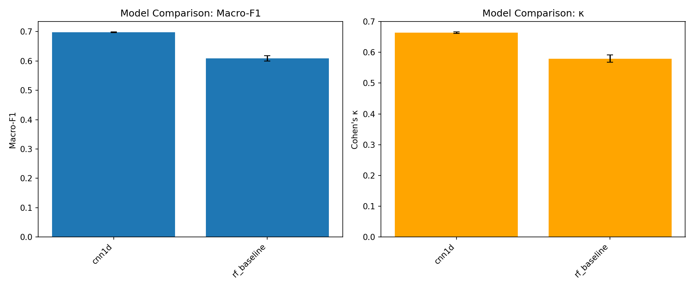

# Sleep Stage Classification — Portfolio Writeup

## 1. Introduction

Sleep staging assigns each 30-second epoch of polysomnography (PSG) to one of five stages: Wake (W), N1, N2, N3, and REM. Automated staging on public EEG supports reproducible ML research and is a standard portfolio problem in biomedical signal processing.

This project uses the **Sleep-EDF Expanded — Sleep Cassette (SC)** subset (~153 recordings, ~195k epochs after preprocessing) with single-channel `EEG Fpz-Cz`. All evaluation is **subject-independent**: entire recordings are held out per fold so the model never sees the same person's data in train and validation.

## 2. Methods

### Preprocessing

Raw EDF files are paired (PSG + hypnogram), resampled to 100 Hz, bandpass filtered (0.3–35 Hz), and segmented into 30-second epochs. Class distribution after trimming: W 33.7%, N1 11.0%, N2 35.4%, N3 6.7%, REM 13.2%.

### Models

| Model | Scope | Rationale |
|-------|-------|-----------|
| RF baseline | 5-fold × 3 seeds | Handcrafted spectral features + sklearn Random Forest; credibility anchor |
| CNN1D | 2-fold, seed 42 | Single-epoch deep learning; clear lift over RF |
| AttnSleep | _skipped_ | Sequence + attention model; MPS OOM on laptop |

Training uses class-weighted cross-entropy, early stopping on validation macro-F1 (patience=3, max 15 epochs), and portfolio defaults in `configs/training/portfolio.yaml`.

### Evaluation

Primary metrics: **macro-F1** (guards against majority-class collapse) and **Cohen's κ**. Per-class F1 reported for all five stages. Results aggregated as mean ± std across folds (and seeds for RF).

## 3. Results

| Model | Scope | Macro-F1 | κ | N1 F1 |
|-------|-------|----------|---|-------|
| RF baseline | 5-fold × 3 seeds | 0.609 ± 0.009 | 0.580 ± 0.012 | 0.279 |
| CNN1D | 2-fold, seed 42 | **0.697 ± 0.002** | **0.664 ± 0.003** | 0.421 |

CNN1D improves macro-F1 by **+0.09** over the RF baseline. Both models achieve strong W and N2 performance; N1 remains the weakest class. CNN1D N1 F1 (~0.42) is higher than RF (~0.28), suggesting the convolutional features capture some sleep-onset patterns RF misses, but N1 is still far below N2/N3.

Confusion matrices (`reports/figures/05_confusion_poc_cnn1d_sleep_edf_sc.png`) show N1 epochs frequently confused with W and N2 — consistent with clinical scoring difficulty.

## 4. Failure analysis: N1 confusion

N1 (sleep onset) is the hardest stage in both clinical and automated scoring. PSG inter-rater agreement for N1 is substantially lower than for N2 or N3 because N1 is defined by alpha attenuation and mixed-frequency activity that overlaps:

- **W → N1:** residual alpha activity in early sleep
- **N1 → N2:** emerging sleep spindles and K-complexes

Our RF baseline collapses many N1 epochs into N2 (N1 F1 0.28). CNN1D improves N1 recall (0.54 vs ~0.35 for RF) but precision remains low (~0.34), meaning the model over-predicts N1. Macro-F1 and per-class N1 F1 are the primary metrics used to detect this failure mode during training.

## 5. Limitations

- **Laptop compute budget:** Portfolio run on M1 MacBook Air; not cloud GPU scale.
- **Partial DL evaluation:** CNN1D on 2 folds only (not full 5-fold CV). RF has stronger statistical coverage (3 seeds).
- **AttnSleep skipped:** MPS out-of-memory at batch_size=64; CPU fallback estimated ~18 h/epoch. Not worth blocking portfolio delivery.
- **Not clinical grade:** No FDA validation, no multi-site deployment testing.
- **Single channel:** Production sleep scoring typically uses multiple EEG + EOG + EMG channels.

## 6. Future work

1. AttnSleep with reduced batch size (16) on MPS for attention visualizations
2. CNN1D full 5-fold CV to match RF rigor
3. Sequence models (CNN-BiLSTM) for transition-aware predictions
4. Cloud GPU sweep for multi-seed variance estimates

## Reproducibility

Each experiment directory contains `config.yaml`, `git_hash.json`, `environment.txt`, per-fold `metrics.json`, and best checkpoints. Regenerate figures: `python scripts/make_figures.py`.
